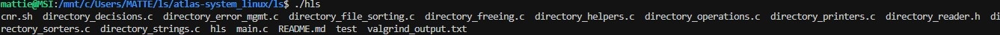
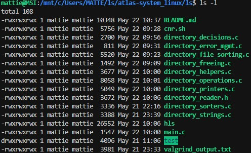
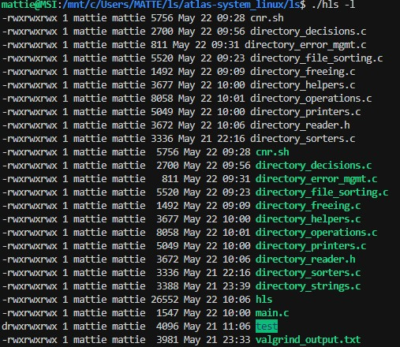

# Atlas Directory Reader

The Atlas Directory Reader is a versatile command-line tool designed to provide detailed information about files and directories within a given directory. It offers various options for customization, including sorting, filtering, and formatting output.

## Features

- Display file and directory information in a customizable format.
- Sort files and directories based on size, time of last modification, or alphabetically.
- Filter files and directories based on visibility and depth.
- Recursive directory traversal for comprehensive analysis.
- Support for long and short listing formats.

## Installation

To use the Atlas Directory Reader, follow these steps:

1. Clone the repository:

   ```bash
   git clone https://github.com/your-username/atlas-directory-reader.git
   ```

2. Compile the program:

  ```bash
  Copy code
  make
  ```

3. Install the program (optional):

  ```bash
  Copy code
  sudo make install
  ```

## Usage

Run the program with the following command:

```bash
./atlas_ls [OPTIONS] [DIRECTORY]
Replace [OPTIONS] with any desired flags (see Options) and [DIRECTORY] with the directory you want to analyze. If no directory is specified, the current directory will be used by default.
```

## Options

The Atlas Directory Reader supports the following options:

- `-l`: Long listing format.
- `-a`: Include hidden files and directories.
- `-r`: Reverse the order of listing.
- `-t`: Sort files and directories by time of last modification.
- `-S`: Sort files and directories by size.
- `-R`: Recursively list subdirectories.
- `-p`: Include a slash (`/`) after directory names.
- `-A`: Include hidden files and directories except for `.` and `..`.
- `-1`: Print one entry per line.
- `-b`: Print non-printable characters in C-style escape sequences.
- `-c`: Use a comma to separate thousands in file sizes.

## Installation

To install the Atlas Directory Reader, follow the steps below:

1. Clone the repository to your local machine.
2. Navigate to the project directory.
3. Compile the source files using a C compiler.
4. Run the compiled executable to use the Atlas Directory Reader.
5. git clone <repository_url>
6. cd atlas-directory-reader
7. gcc -o atlas_ls *.c
8. ./atlas_ls [OPTIONS] [DIRECTORY]
9. Replace `[OPTIONS]` with any desired flags and `[DIRECTORY]` with the directory you want to analyze.


## Differences from `ls`

While the Atlas Directory Reader (`atlas_ls`) shares similarities with the traditional `ls` command in Unix-like operating systems, there are some notable differences:

1. **File Type Coloring**: The traditional `ls` command often utilizes file type coloring to distinguish between different types of files (e.g., directories, executables, symbolic links). This feature enhances visual recognition and helps users quickly identify file types. However, the Atlas Directory Reader currently does not implement file type coloring.

2. **Column Formatting**: When listing files and directories, the traditional `ls` command typically arranges them into multiple columns to optimize space usage and readability. This column-based layout makes it easier to scan through large lists of files. In contrast, the Atlas Directory Reader (`atlas_ls`) currently does not format files into columns, instead opting for a simpler linear list format.

3. **Attribute Columns Formatting**: The traditional `ls` command often formats attribute columns (e.g., permissions, file sizes, modification dates) into neat columns for better readability. This organized layout makes it easier to compare attributes across different files. However, the Atlas Directory Reader (`atlas_ls`) currently does not implement advanced column formatting for attributes.







## Function Descriptions
<div style="background-color: #808080; color: #0000FF; padding: 15px; border-radius: 5px;">

### `perm_log`

The `perm_log` function in the Atlas Directory Reader is responsible for generating a string representation of file permissions based on the file mode. It converts the file mode into a symbolic representation of the file's permissions.

- **Parameters**:
  - `buffer`: A character array where the generated permission string will be stored.
  - `mode`: The file mode represented by a `mode_t` type variable.

- **Return Value**: None

- **Functionality**:
  - The function iterates through each permission bit in the file mode and generates a symbolic representation for each permission (read, write, and execute) for the owner, group, and others.
  - It uses bitwise AND operations with predefined macros (e.g., `S_IRUSR` for user read permission) to check the presence of each permission bit in the file mode.
  - For each permission, it appends the corresponding symbol ('r' for read, 'w' for write, 'x' for execute, and '-' for no permission) to the buffer.
  - Finally, it terminates the generated string with a null character to mark the end of the string.

This function plays a crucial role in displaying detailed file information, including permissions, when listing directories, providing users with insights into the access rights of files in the system.

---

### `group_grabber`

The `group_grabber` function in the Atlas Directory Reader is responsible for retrieving the group name associated with a given group ID (`gid_t`). It fetches the group name from the system's group database using the provided group ID.

- **Parameters**:
  - `buffer`: A character array where the retrieved group name will be stored.
  - `group_id`: The group ID (GID) of the group whose name needs to be retrieved.

- **Return Value**: None

- **Functionality**:
  - The function utilizes the `getgrgid` function provided by the system's group database to fetch the group entry corresponding to the given group ID.
  - It extracts the group name from the fetched group entry and copies it into the provided buffer.
  - If the group entry corresponding to the provided group ID is not found, the function stores an empty string in the buffer.

This function enhances the readability of file information by providing human-readable group names alongside other file attributes when listing directories.

---

### `user_grabber`

The `user_grabber` function in the Atlas Directory Reader is responsible for retrieving the username associated with a given user ID (`uid_t`). It fetches the username from the system's user database using the provided user ID.

- **Parameters**:
  - `buffer`: A character array where the retrieved username will be stored.
  - `user_id`: The user ID (UID) of the user whose name needs to be retrieved.

- **Return Value**: None

- **Functionality**:
  - The function utilizes the `getpwuid` function provided by the system's user database to fetch the user entry corresponding to the given user ID.
  - It extracts the username from the fetched user entry and copies it into the provided buffer.
  - If the user entry corresponding to the provided user ID is not found, the function stores an empty string in the buffer.

This function enhances the readability of file information by providing human-readable usernames alongside other file attributes when listing directories.

---

### `last_modified`

The `last_modified` function in the Atlas Directory Reader is responsible for converting a time value (`time_t`) representing the last modification time of a file into a human-readable string format.

- **Parameters**:
  - `buffer`: A character array where the human-readable time string will be stored.
  - `time_val`: The time value (`time_t`) representing the last modification time of a file.

- **Return Value**: None

- **Functionality**:
  - The function utilizes the `ctime` function provided by the C standard library to convert the time value (`time_t`) into a human-readable string format.
  - It copies the resulting time string into the provided buffer.

This function enhances the readability of file information by presenting the last modification time of files in a familiar and understandable format.

---

### `file_type`

The `file_type` function in the Atlas Directory Reader serves to determine the type of a file based on its mode, which is represented by a combination of file type and permission bits. Here's how it works:

- **Parameters**:
  - `mode`: The file mode represented by a `mode_t` type variable.

- **Return Value**:
  - Character representing the file type:
    - `'-'`: Regular file
    - `'d'`: Directory
    - `'c'`: Character device
    - `'b'`: Block device
    - `'p'`: FIFO (named pipe)
    - `'l'`: Symbolic link
    - `'s'`: Socket

- **Algorithm**:
  - The function first checks if the file mode corresponds to a regular file using the macro `S_ISREG(mode)`. If true, it returns `'-'`.
  - It then checks for other file types in a similar manner:
    - Directory (`S_ISDIR(mode)`): Returns `'d'`.
    - Character device (`S_ISCHR(mode)`): Returns `'c'`.
    - Block device (`S_ISBLK(mode)`): Returns `'b'`.
    - FIFO (named pipe) (`S_ISFIFO(mode)`): Returns `'p'`.
    - Symbolic link (`S_ISLNK(mode)`): Returns `'l'`.
    - Socket (`S_ISSOCK(mode)`): Returns `'s'`.
  - If none of the above conditions match, it defaults to returning `'-'`.

This function is crucial for the Atlas Directory Reader as it helps in displaying file types when listing directories, providing users with valuable information about the types of files present in the system.

---

### `flag_interpreter`

The `flag_interpreter` function in the Atlas Directory Reader is responsible for interpreting the command-line flags provided to the `hls` program and setting corresponding configurations in the `ls_flag_t` structure.

- **Parameters**:
  - `arg`: A string representing the command-line argument containing the flags.
  - `flags`: A pointer to the `ls_flag_t` structure where the configurations will be set.

- **Return Value**:
  - `0` on success.
  - `2` if an invalid option is encountered.

- **Functionality**:
  - The function iterates through each character in the `arg` string, which represents the command-line flags.
  - It sets specific configurations in the `flags` structure based on the encountered flags. These configurations include options such as one-per-line display, including hidden files, sorting options, and recursive listing.
  - If an invalid option is encountered, the function prints an error message indicating the invalid option and returns `2`.

This function plays a crucial role in parsing and interpreting command-line flags to customize the behavior of the `hls` program according to user preferences.

---

### `add_subdirectories`

The `add_subdirectories` function in the Atlas Directory Reader is responsible for adding subdirectories to the directory linked list.

- **Parameters**:
  - `dir`: A pointer to the current directory node.
  - `flags`: A pointer to the `ls_flag_t` structure containing command-line flags.

- **Return Value**:
  - A pointer to the head of the directory linked list.

- **Functionality**:
  - This function iterates through the list of files in the current directory and identifies subdirectories.
  - For each subdirectory found, it creates a new directory node and adds it to the directory linked list.
  - If the `-R` (recursive) flag is set, it recursively traverses the subdirectories to add their subdirectories as well.
  - The function returns a pointer to the head of the directory linked list containing all subdirectories.

This function facilitates the recursive traversal of directories, enabling the `hls` program to list the contents of subdirectories when the `-R` flag is specified.

---

### `manage_subdirs`

The `manage_subdirs` function in the Atlas Directory Reader manages the addition of subdirectories to the directory linked list.

- **Parameters**:
  - `head`: A pointer to a pointer to the head of the directory linked list.
  - `dir`: A pointer to the current directory node.
  - `flags`: A pointer to the `ls_flag_t` structure containing command-line flags.

- **Return Value**:
  - None

- **Functionality**:
  - This function calls the `add_subdirectories` function to add subdirectories to the directory linked list.
  - It handles errors encountered during the addition of subdirectories and prints error messages if necessary.

This function is essential for managing subdirectories and ensuring proper traversal of directory structures.

---

### `add_dir`

The `add_dir` function in the Atlas Directory Reader adds a directory node to the directory linked list.

- **Parameters**:
  - `name`: The name of the directory.
  - `stream`: A pointer to the directory stream returned by `opendir`.
  - `head`: A pointer to a pointer to the head of the directory linked list.

- **Return Value**:
  - An integer indicating the success or failure of the operation.

- **Functionality**:
  - This function creates a new directory node, populates it with the provided information, and adds it to the directory linked list.

This function enables the representation of directories within the directory structure, facilitating traversal and manipulation.

---

### `add_file`

The `add_file` function adds a file to the linked list of files.

- **Parameters**:
  - `file_name`: The name of the file to be added.
  - `dir_name`: The name of the directory containing the file.
  - `head`: Pointer to the head of the linked list.

- **Return Value**:
  - An integer indicating the success or failure of the operation.

- **Functionality**:
  - This function creates a new file node, populates it with the file name, directory name, and file information, and adds it to the linked list of files.

This function plays a crucial role in populating the file list during directory traversal.

---

### `file_maker`

The `file_maker` function creates a new file node and initializes it with the provided information.

- **Parameters**:
  - `name`: The name of the file.
  - `dir_name`: The name of the directory containing the file.
  - `info`: Pointer to a `struct stat` containing file information.

- **Return Value**:
  - A pointer to the newly created file node.

- **Functionality**:
  - This function allocates memory for a new file node and initializes its members with the provided information.
  - It sets the `name`, `dir_name`, and `info` fields of the file node.
  - Additionally, it initializes the `next` and `prev` pointers of the file node to `NULL`.

The `file_maker` function is used during the process of adding files to the linked list of files.

---

### `should_open_directory`

The `should_open_directory` function determines whether a directory should be opened for recursion based on certain conditions.

- **Parameters**:
  - `directory_node`: Pointer to the file node representing the directory.
  - `flags`: Pointer to the `ls_flag_t` structure containing flags indicating program options.

- **Return Value**:
  - `true` if opening the directory is approved.
  - `false` if opening the directory is rejected.

- **Functionality**:
  - This function checks various conditions to determine whether a directory should be opened for recursion.
  - It first checks if the file represented by the directory node is indeed a directory using the `S_ISDIR` macro.
  - Next, it checks if the directory name starts with a period (`.`) and handles special cases such as `.` and `..`.
  - Depending on the program options specified by the flags, it determines whether to exclude hidden directories.
  - Finally, it approves opening the directory if all conditions are met; otherwise, it rejects opening the directory.

The `should_open_directory` function is crucial for deciding whether to recursively explore subdirectories during directory traversal.

---

### `FAS - first_alphabetical_string`

The `FAS - first_alphabetical_string` function determines which of two strings comes first alphabetically.

- **Parameters**:
  - `strpt1`: Pointer to the first string.
  - `strpt2`: Pointer to the second string.

- **Return Value**:
  - A pointer to the string that comes first alphabetically.

- **Functionality**:
  - This function recursively compares two strings character by character to determine their alphabetical order.
  - It handles special cases such as empty strings (`\0`) and strings starting with a period (`.`).
  - The comparison considers both uppercase and lowercase letters.
  - If the two strings have the same starting character, it continues comparing the subsequent characters.
  - The function returns a pointer to the string that comes first alphabetically.

The `FAS - first_alphabetical_string` function is used for sorting strings in alphabetical order, essential for various sorting and comparison operations in the directory reader.

---

### `print_dirs`

The `print_dirs` function is responsible for printing the contents of directories based on specified flags.

- **Parameters**:
  - `head`: Pointer to the head of the directory node list.
  - `flags`: Pointer to the structure containing flags indicating the options passed to the program.
  - `printer`: Pointer to the function responsible for printing file nodes.

- **Return Value**:
  - An integer representing the success or failure of the printing operation.

- **Functionality**:
  - This function traverses the linked list of directory nodes and prints the contents of each directory.
  - It calls the appropriate printer function to print the files within each directory node based on the specified flags.
  - The printing behavior can be modified by the flags provided, such as long format (`-l`), one entry per line (`-1`), and sorting options.
  - Errors encountered during printing, such as permission denied or inaccessible directories, are handled by printing error messages.

The `print_dirs` function acts as a central component for printing directory contents in various formats, facilitating flexible output customization based on user preferences and command-line options.

---

### `print_long_list`

The `print_long_list` function is responsible for printing file details in long format.

- **Parameters**:
  - `file_list`: Pointer to the head of the file node list.
  - `flags`: Pointer to the structure containing flags indicating the options passed to the program.

- **Return Value**:
  - None (void function).

- **Functionality**:
  - This function traverses the linked list of file nodes and prints detailed information about each file in long format.
  - Information includes file permissions, number of links, owner, group, file size, last modification time, and file name.
  - Permissions are displayed in symbolic notation, and ownership information is retrieved using `user_grabber` and `group_grabber` functions.
  - File sizes are formatted for readability, and the last modification time is presented in a human-readable format.
  - The output format adheres to the conventions of the standard `ls -l` command in Unix-like operating systems.

The `print_long_list` function provides users with comprehensive information about files in a directory, facilitating detailed analysis and management of file properties.

---

### `print_short_list`

The `print_short_list` function is responsible for printing file names in short format.

- **Parameters**:
  - `file_list`: Pointer to the head of the file node list.
  - `flags`: Pointer to the structure containing flags indicating the options passed to the program.

- **Return Value**:
  - None (void function).

- **Functionality**:
  - This function traverses the linked list of file nodes and prints only the file names in a concise, columnar format.
  - Files are listed in multiple columns for better readability, similar to the behavior of the standard `ls` command in Unix-like operating systems.
  - If the `-1` flag is set, files are listed one per line instead of in columns.

The `print_short_list` function provides users with a compact view of file names, making it easier to quickly scan through a directory's contents.

---

### `error_message_printing`

Prints an The `error_message_printing` function is responsible for printing error messages related to file or directory access.

- **Parameters**:
  - `filename`: The name of the file or directory causing the error.
  - `argv0`: The name of the program.

- **Return Value**:
  - `error_code`: The error code indicating the type of error.

- **Functionality**:
  - This function first determines the specific error code based on the value of `errno`.
  - It then formats an error message using `sprintf` according to the error template determined by the error code.
  - The error message, along with additional system error information obtained using `perror`, is printed to the standard error stream.
  - Finally, the function returns the error code.

The `error_message_printing` function enhances user experience by providing informative error messages in case of file or directory access failures, helping users diagnose and address issues more effectively.

---

### `char_search`

The `char_search` function searches for the first occurrence of a specified character within a given string.

- **Parameters**:
  - `str`: Pointer to the string to be searched.
  - `c`: The character to search for within the string.

- **Return Value**:
  - If the character is found, it returns a pointer to the first occurrence of the character within the string.
  - If the character is not found, it returns `NULL`.

- **Functionality**:
  - The function iterates through the string character by character until it finds the specified character or reaches the end of the string.
  - If the character is found, a pointer to its location within the string is returned.
  - If the character is not found, `NULL` is returned.

The `char_search` function provides a basic utility for searching characters within strings, which is utilized in various parts of the Atlas Directory Reader for tasks such as parsing command-line arguments and file name manipulation.

---

### `string_copy`

The `string_copy` function copies a source string to a destination buffer.

- **Parameters**:
  - `dest`: Pointer to the destination buffer where the string will be copied.
  - `src`: Pointer to the source string to be copied.

- **Return Value**:
  - Upon successful completion, the function returns a pointer to the destination buffer (`dest`).
  - If either `dest` or `src` is `NULL`, the function returns `NULL`.

- **Functionality**:
  - The function iterates through the characters of the source string and copies them to the destination buffer.
  - It terminates the copied string with a null character to ensure proper string termination.

The `string_copy` function is a custom implementation of the `strcpy` function, providing a way to copy strings within the Atlas Directory Reader. It ensures proper memory handling and termination of the copied string.

---

### `string_dup`

The `string_dup` function duplicates a source string to a newly allocated memory space.

- **Parameters**:
  - `source_string`: Pointer to the source string to be duplicated.

- **Return Value**:
  - Upon successful completion, the function returns a pointer to the duplicate string.
  - If memory allocation fails, it returns `NULL`.

- **Functionality**:
  - The function calculates the length of the source string.
  - It allocates memory space for the duplicate string.
  - Then, it copies each character of the source string to the newly allocated memory.
  - Finally, it returns a pointer to the duplicate string.

The `string_dup` function is crucial for creating duplicate strings within the Atlas Directory Reader, facilitating various string operations while ensuring proper memory management.

---

### `str_len`

The `str_len` function calculates the length of a string.

- **Parameters**:
  - `s`: Pointer to the string whose length needs to be determined.

- **Return Value**:
  - An integer representing the length of the string.

- **Functionality**:
  - The function initializes a variable `strlen` to store the length of the string.
  - It iterates through the string until the null terminator is encountered.
  - For each character encountered, it increments the `strlen` variable.
  - Finally, it returns the length of the string.

The `str_len` function is essential for various operations within the Atlas Directory Reader, such as determining the length of file and directory names, aiding in memory allocation, and performing string manipulations.

---

### `recent_file_sort`

The `recent_file_sort` function sorts a linked list of file nodes based on the time of most recent modification.

- **Parameters**:
  - `head`: Pointer to the head of the file node list to be sorted.

- **Return Value**:
  - Pointer to the head of the sorted list.

- **Functionality**:
  - If the list is empty or contains only one node, the function returns the list as it is.
  - The function traverses the list, comparing each file node with its next node.
  - If a node has a more recent modification time than the next node, it swaps the nodes.
  - This process continues until the entire list is sorted.
  - If any unsorted pairs are found during traversal, the function recursively re-sorts the list.
  - Finally, the function returns the head of the sorted list.

The `recent_file_sort` function is crucial for organizing file nodes in ascending order based on their modification times, enabling users to view files in chronological order.

---

### `compare_recent`

The `compare_recent` function compares two file nodes based on their time of most recent modification.

- **Parameters**:
  - `a`: Pointer to the first file node.
  - `b`: Pointer to the second file node.

- **Return Value**:
  - Returns 1 if the first file node (`a`) is more recent than the second file node (`b`), otherwise returns 0.

- **Functionality**:
  - The function compares the modification times of the two file nodes (`a` and `b`).
  - If the modification times are equal, it compares their names alphabetically.
  - If the names are equal, it returns `NULL`.
  - If the modification times are different, it returns 1 if the modification time of `a` is more recent than that of `b`, otherwise returns 0.

The `compare_recent` function is essential for the sorting algorithm used in `recent_file_sort`, facilitating the comparison of file nodes based on their modification times.

---

### `swap_files`

The `swap_files` function swaps the positions of two file nodes in a linked list.

- **Parameters**:
  - `a`: Pointer to the first file node.
  - `b`: Pointer to the second file node.

- **Functionality**:
  - The function swaps the positions of two file nodes (`a` and `b`) in a linked list.
  - It adjusts the `prev` and `next` pointers of neighboring nodes to maintain the integrity of the linked list structure.

The `swap_files` function is utilized within sorting algorithms, such as `recent_file_sort`, to reposition file nodes based on specific criteria.

---

### `file_size_sort_checker`

The `file_size_sort_checker` function is a helper function for sorting file nodes in a linked list based on file size.

- **Parameters**:
  - `head`: Pointer to the head of the linked list.

- **Return**:
  - Pointer to the head of the sorted list.

- **Functionality**:
  - The function iterates through the linked list of file nodes, checking if adjacent nodes are in sorted order based on file size.
  - If a pair of adjacent nodes is not in sorted order, it invokes the `file_size_sort` function to re-sort the list.
  - This process continues until the entire list is sorted.

The `file_size_sort_checker` function ensures that the linked list of file nodes remains sorted by size, improving efficiency when accessing and processing file information.

---

### `file_size_sort`

The `file_size_sort` function is responsible for sorting a linked list of file nodes based on file size.

- **Parameters**:
  - `head`: Pointer to the head of the linked list.

- **Return**:
  - Pointer to the head of the sorted list.

- **Functionality**:
  - The function compares adjacent file nodes in the linked list based on their file sizes.
  - If the size of the current node is greater than the size of the next node, or if the sizes are equal but the filenames are in alphabetical order, the nodes are swapped.
  - This process continues until the entire list is sorted by file size.

The `file_size_sort` function ensures that the files in the linked list are arranged in ascending order of file size, facilitating easier access and management of files.

---

### `sort_dir_size`

The `sort_dir_size` function is responsible for sorting a linked list of directory nodes based on the size of the directories.

- **Parameters**:
  - `head`: Pointer to the head of the linked list.

- **Return**:
  - Pointer to the head of the sorted list.

- **Functionality**:
  - The function iterates through the linked list of directory nodes and compares the sizes of adjacent directories.
  - If the size of the current directory node is greater than the size of the next directory node, the nodes are swapped.
  - This process continues until the entire list is sorted by directory size.

The `sort_dir_size` function ensures that directories in the linked list are arranged in ascending order of size, facilitating easier management and navigation of directories.

---

### `comp_dir_size`

The `comp_dir_size` function is a helper function used for comparing two directory nodes based on their sizes.

- **Parameters**:
  - `a`: Pointer to the first directory node.
  - `b`: Pointer to the second directory node.

- **Return**:
  - An integer value indicating the result of the comparison:
    - `0`: If the size of directory `a` is equal to the size of directory `b`.
    - `-1`: If the size of directory `a` is less than the size of directory `b`.
    - `1`: If the size of directory `a` is greater than the size of directory `b`.

- **Functionality**:
  - The function compares the sizes of two directory nodes `a` and `b`.
  - If the size of directory `a` is less than the size of directory `b`, `-1` is returned.
  - If the size of directory `a` is equal to the size of directory `b`, `0` is returned.
  - If the size of directory `a` is greater than the size of directory `b`, `1` is returned.

The `comp_dir_size` function enables the `sort_dir_size` function to perform sorting of directory nodes based on their sizes by providing a comparison mechanism.

---

### `swap_dir_pos`

The `swap_dir_pos` function is responsible for swapping the positions of two directory nodes in a linked list.

- **Parameters**:
  - `a`: Pointer to the first directory node.
  - `b`: Pointer to the second directory node.

- **Functionality**:
  - The function swaps the positions of two directory nodes `a` and `b` in a linked list.
  - It adjusts the `next` and `prev` pointers of the neighboring nodes to ensure proper linkage after the swap.

The `swap_dir_pos` function facilitates the sorting algorithm by allowing the rearrangement of directory nodes based on certain criteria.

---

### `free_it_all`

The `free_it_all` function is responsible for freeing all memory allocated for directories and files in the linked lists.

- **Parameters**:
  - `d_head`: The head of the directory list.
  - `f_head`: The head of the file list.

- **Functionality**:
  - The function iterates through the directory list (`d_head`) and frees the memory allocated for each directory node.
  - For each directory node, it also frees the memory allocated for the directory name and calls the `free_dir_files` function to free the memory allocated for the files in that directory.
  - Finally, it frees the memory allocated for the directory node itself.
  - After freeing the directory list, it proceeds to free the memory allocated for the file list (`f_head`) by calling the `free_dir_files` function.

The `free_it_all` function ensures proper cleanup of memory resources to prevent memory leaks.

---

### `free_dir_files`

The `free_dir_files` function is responsible for freeing the linked list of files in a directory.

- **Parameters**:
  - `file_list`: The head of the file list to be freed.

- **Functionality**:
  - The function iterates through the linked list of files (`file_list`) and frees the memory allocated for each file node.
  - For each file node, it frees the memory allocated for the file information (`info`), file name (`name`), and directory name (`dir_name`).
  - Finally, it frees the memory allocated for the file node itself.

The `free_dir_files` function ensures proper cleanup of memory resources associated with files in a directory to prevent memory leaks.

</div>
-----------------------------------------------------------------------------

# The real C - ls 


# C - ls

## Concepts
For this project, we expect you to look at this concept:

- [EYNTK] Create your own ls

## Resources
Read or watch:

- Everything you need to know to write your own ls
- man ls

## Learning Objectives
At the end of this project, you are expected to be able to explain to anyone, without the help of Google:

**General**
- How does ls work?
- What are all the functions used by ls?

## Requirements
**General**
- Allowed editors: vi, vim, emacs
- All your files will be compiled on Ubuntu 14.04 LTS
- Your C programs and functions will be compiled with gcc 4.8.4 using the flags -Wall -Werror -Wextra and -pedantic
- All your files should end with a new line
- A README.md file, at the root of the folder of the project is mandatory
- Your code should use the Betty style. It will be checked using betty-style.pl and betty-doc.pl
- No more than 5 functions per file
- All your header files should be include guarded
- Valgrind should show 0 memory leak and 0 error
- Unless specified otherwise, your program must have the exact same output as ls as well as the exact same error output - except for alignment.

**Allowed Functions and System Calls**
- opendir (man 3 opendir)
- readdir (man 3 readdir)
- closedir (man 3 closedir)
- exit (man 3 exit)
- free (man 3 free)
- lstat (man 2 lstat)
- malloc (man 3 malloc)
- perror (man 3 perror)
- write (man 2 write)
- printf (man 3 printf)
- sprintf (man 3 sprintf)
- fprintf (man 3 fprintf)
- readlink (man 2 readlink)
- ctime (man 3 ctime)
- getpwuid (man 3 getpwuid)
- getgrgid (man 3 getgrgid)
- errno (man 3 errno)

## More Info
**Compilation**  
Your program will be compiled this way:  
```c
gcc -Wall -Werror -Wextra -pedantic *.c -o hls
```

Every task depends on the previous ones. We strongly encourage you to read the entire project and think about the way you are going to design your entire ls before starting. (This is actually something you should do all the time :)).

**Testing**  
Your program should give the same result as the real ls.

```c
$ ls test
abc  BCD  file  file2  file3  folder1  folder2  folder3
$ ./hls test
abc  BCD  file  file2  file3  folder1  folder2  folder3
$ ls -1
abc
BCD
file
file2
file3
folder1
folder2
folder3
hls
$ ./hls -1
abc
BCD
file
file2
file3
folder1
folder2
folder3
hls
$
```

# Tasks

## Task 0: Let's start with something simple! *(mandatory)*

Create a program that lists the content of the current directory.

Usage: `hls`

```c
wilfried@~$ ls
abc  file  File2  file3  folder1  Folder2  folder3  hls
wilfried@~$ ./hls
abc  file  File2  file3  folder1  Folder2  folder3  hls
wilfried@~$

```

## Task 1: Maybe some parameters? *(mandatory)*

Your program should now take one or more file or directory names as parameters.

Usage: `hls [FILE]...`

Errors must be printed the same way than `ls` does:

- In stderr
- Starting by `<program>:` (`<program>` being `argv[0]`)
- `No such file or directory`, `Permission denied`, etc…
- Don’t forget the exit value

```c
wilfried@~$ ls test
abc  file  File2  file3  folder1  Folder2  folder3
wilfried@~$ ./hls test
abc  file  File2  file3  folder1  Folder2  folder3
wilfried@~$ ./hls test/folder1/ test
test:
abc  file  File2  file3  folder1  Folder2  folder3

test/folder1/:
folder1-1  folder1-2  folder1-3
/simple_ls$ ./hls test/random
./hls: cannot access test/random: No such file or directory
wilfried@~$
```

## Task 2: What about options? *(mandatory)*

Implement the `-1` option.

Usage: `hls [-1] [FILE]...`

For the rest of the project, an option will be identified by a command-line argument starting with the character `-` (like `ls`).

```c
wilfried@~$ ls test -1
abc
file
File2
file3
folder1
Folder2
folder3
wilfried@~$ ./hls test -1
abc
file
File2
file3
folder1
Folder2
folder3
wilfried@~$
```

## Task 3: Hidden files *(mandatory)*

Implement the `-a` option.

Usage: `hls [-a1] [FILE]...`

```c
wilfried@~$ ls -a test
.  ..  abc  file  File2  file3  folder1  Folder2  folder3  .hidden1  .hidden2  ..hidden3
wilfried@~$ ./hls -a test
.  ..  abc  file  File2  file3  folder1  Folder2  folder3  .hidden1  .hidden2  ..hidden3
wilfried@~$ ./hls -a test/folder1
.  ..  folder1-1  folder1-2  folder1-3
wilfried@~$  
```

## Task 4: Almost all *(mandatory)*

Implement the `-A` option.

Usage: `hls [-A] [FILE]...`

```c
wilfried@~$ ls -A test
abc  file  File2  file3  folder1  Folder2  folder3  .hidden1  .hidden2  ..hidden3
wilfried@~$ ./hls -A test
abc  file  File2  file3  folder1  Folder2  folder3  .hidden1  .hidden2  ..hidden3
wilfried@~$ ./hls -A test/folder1
folder1-1  folder1-2  folder1-3
wilfried@~$
```


## Task 5: More details *(mandatory)*

Implement the `-l` option.

Usage: `hls [-l] [FILE]...`

```c
wilfried@~$ ls -l test
total 12
-rw-rw-r-- 1 wilfried wilfried    0 May  8 00:19 abc
-rw-rw-r-- 1 wilfried wilfried    0 Apr 18 14:04 file
-rw-rw-r-- 1 wilfried wilfried    0 Apr 18 14:04 File2
-rw-rw-r-- 1 wilfried wilfried    0 Apr 18 14:04 file3
drwxrwxr-x 5 wilfried wilfried 4096 Apr 30 15:22 folder1
drwxrwxr-x 2 wilfried wilfried 4096 May  7 15:36 Folder2
drwxrwxr-x 3 wilfried wilfried 4096 May  7 15:37 folder3
wilfried@~$ ./hls -l test
-rw-rw-r-- 1 wilfried wilfried    0 May  8 00:19 abc
-rw-rw-r-- 1 wilfried wilfried    0 Apr 18 14:04 file
-rw-rw-r-- 1 wilfried wilfried    0 Apr 18 14:04 File2
-rw-rw-r-- 1 wilfried wilfried    0 Apr 18 14:04 file3
drwxrwxr-x 5 wilfried wilfried 4096 Apr 30 15:22 folder1
drwxrwxr-x 2 wilfried wilfried 4096 May  7 15:36 Folder2
drwxrwxr-x 3 wilfried wilfried 4096 May  7 15:37 folder3
wilfried@~$
```

You might notice the `total 12` in the first line of `ls -l`. You can ignore this value for this exercise.
